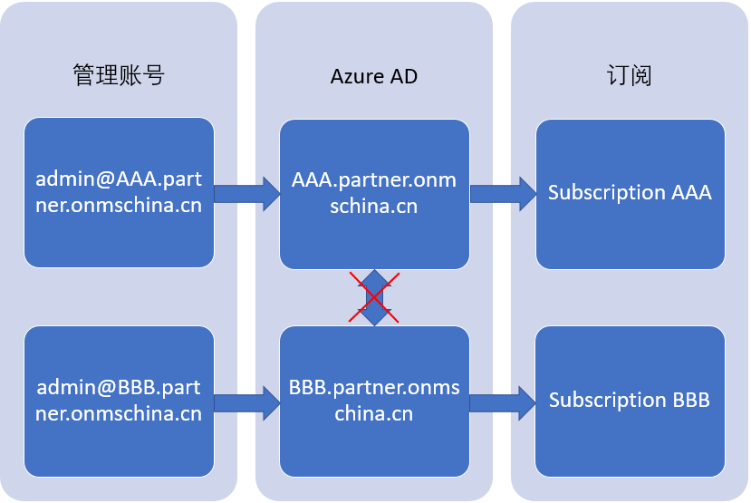
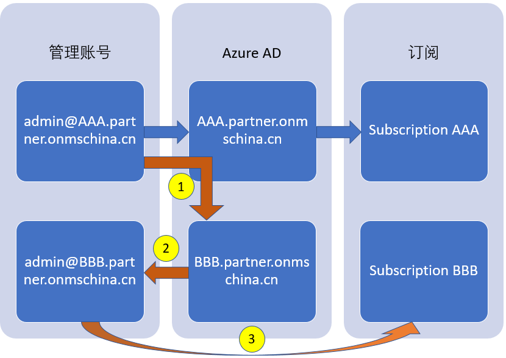

<properties
                pageTitle="Azure AD 与 Azure 订阅在 Azure 中国的架构限制与最佳实践"
                description="Azure AD 与 Azure 订阅在中国的限制以及解决多个 Azure AD 目录关联的最佳实践"
                services="active-directory"
                documentationCenter=""
                authors=""
                manager=""
                editor=""
                tags="Azure AD,Azure 订阅,Azure 中国"/>

<tags
                ms.service="active-directory-aog"
                ms.date="2016/12/14"
                wacn.date="2016/12/14"/>

# Azure AD 与 Azure 订阅在 Azure 中国的架构限制与最佳实践   

## 什么是 Azure Active Directory  

Azure Active Directory (Azure AD) 是 Microsoft 提供的基于多租户云的目录和身份管理服务。Azure AD 包含整套身份管理功能，例如多重身份验证、设备注册、自助密码管理、自助组管理、特权帐户管理、基于角色的访问控制、应用程序使用情况监视、多样化审核以及安全监视和警报。这些功能可以帮助保护基于云的应用程序的安全，简化 IT 流程，削减成本，以及确保实现公司的合规目标。  

## 什么是Azure订阅  

订阅是 Azure 一个重要的概念，它能赋予 Azure 账户对 Windows Azure 服务和 Azure 传统管理门户的访问权限。订阅内含有各类可用的Azure资源，同时也是对用户收取费用的最小单位。

## Azure AD 与 Azure 订阅的关系  

请参阅 [Azure 订阅与 Azure Active Directory 的关联方式](https://www.azure.cn/documentation/articles/active-directory-how-subscriptions-associated-directory/)。

>[AZURE.NOTE]
Azure 中国的 Azure AD 目前只支持全局管理员和用户；
Azure 中国的 Azure AD 不支持 Microsoft 账户用户。  

## Azure AD管理员与Azure订阅管理员的区别  

默认情况下，当您注册时，系统将为您分配服务管理员角色。如果其他人需要使用同一个订阅登录和访问服务，则您可以将他们添加为协同管理员。服务管理员和协同管理员是 Azure 订阅信任的 Azure AD 组织内部的工作或学校帐户。  
Azure AD 提供一组不同的管理角色，用于管理目录和标识相关的功能。例如，目录的全局管理员可以将用户和组添加到目录，或者要求对用户执行多重身份验证。将为创建目录的用户分配全局管理员角色，而他们又可以向其他用户分配管理员角色。  
但必须注意，Azure 订阅管理员和 Azure AD 目录管理员是两个不同的概念。Azure 订阅管理员可以管理 Azure 中的资源，还可以在 Azure 经典门户中查看 Active Directory 扩展（因为 Azure 经典门户是一种 Azure 资源）。Directory 管理员可以管理目录中的属性。

## Azure AD在Azure中国的限制  

截至目前（2016年12月）为止，Azure 中国的 Azure AD 不支持 Microsoft 账户用户，也不支持 Azure AD B2B 合作功能。由此带来的限制如下：  

1. 无法为独立的 Azure AD 目录添加来自其他目录的来宾账号；  
2. 用户无法更改 Azure 订阅与 Azure AD 的信任关系。  

在 Azure 中国，由于以上功能的限制，当用户分别创建两个 Azure AD 目录 AAA 和 BBB 并购买订阅之后，无法将两个目录相关联。  

## 最佳实践  

对于需要多个 Azure AD 目录相互关联的客户，我们建议部署的最佳实践如下：  

1.	使用 admin@AAA.partner.onmschina.cn 账号在 Azure 传统管理门户中创建 BBB.partner.onmschina.cn 目录，这样可以让 admin@AAA.partner.onmschina.cn 被添加为 BBB.partner.onmschina.cn 目录的来宾账号。
2.	为 BBB.partner.onmschina.cn 目录添加管理账号 admin@BBB.partner.onmschina.cn，需要注意这时 admin@BBB.partner.onmschina.cn 因为没有相应的订阅，无法成功登录传统管理门户。
3.	使用 EA 门户，将 admin@BBB.partner.onmschina.cn 加到账号列表内，并为其购买订阅 BBB。

通过以上步骤，可以使 AAA 与 BBB 目录分别拥有自己的管理账号和订阅。同时，由于 admin@AAA.partner.onmschina.cn 账号同时存在于 AAA 和 BBB 目录里，客户可以使用该账号将两个目录里的账号互相添加为来宾账号，由此达到多目录间相互关联的目的。

##相关信息  

- 若要了解有关如何在 Azure 中控制资源访问的详细信息，请参阅[了解 Azure 中的资源访问权限](/documentation/articles/active-directory-understanding-resource-access/)；
- 有关如何在 Azure AD 中分配角色的详细信息，请参阅[在 Azure Active Directory 中分配管理员角色](/documentation/articles/active-directory-assign-admin-roles/)。
