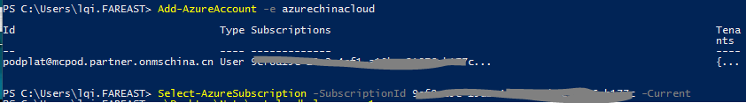
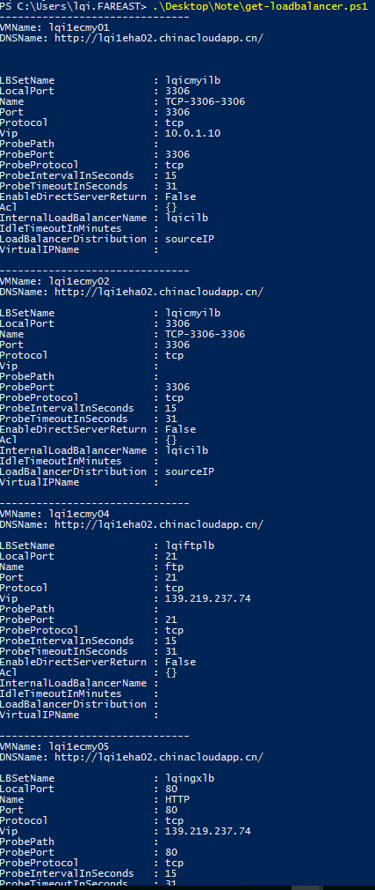

# 使用Powershell查看经典模式下的负载均衡配置  

在 ASM 模式中，负载均衡是通过更新虚拟机来设置的。查询负载均衡，只能通过一台台虚拟机进行查询。如果订阅中的虚拟机数量众多，查询起来也会相当费力。这里开发了一个小脚本，能够一次性查询出当前订阅下所有 ASM 模式中配置的负载均衡设置。  

```  
$cs= get-azurevm
$n=0
while ( $n -lt $cs.Count )
{
 $ep = $cs[$n].VM | Get-AzureEndpoint
 $m=0
 $lb=0
 while ($m -lt $ep.count)
 {
	if ($ep[$m].LBSetName)
		{
			$lb = 1
		}
	$m = $m + 1
 }
 $m=0
 if ($lb -eq 1)
 {
	echo -------------------------------
	$vmname = "VMName: "
	$DNSName = "DNSName: "
	$vmname + $cs[$n].Name
	$DNSName + $cs[$n].DNSName
	echo "    "
	while ($m -lt $ep.count)
	{
		if ($ep[$m].LBSetName)
		{
			$ep[$m]
		}
		$m = $m + 1
	}	
 }
 $n = $n + 1
}

```  

将上面脚本保存为 .ps1 的后缀名。
登录到 AzureChinaCloud，如果有多个订阅，请将要查询的订阅设置为当前订阅。



运行脚本。  
一个示例输出如下，其中包含了内部负载均衡，外部负载均衡。如果虚拟机处于关机状态，则 VIP 会显示为空。


