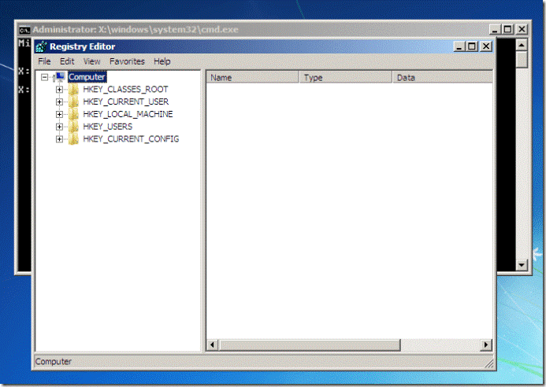
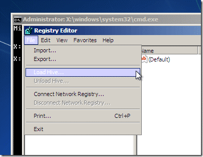
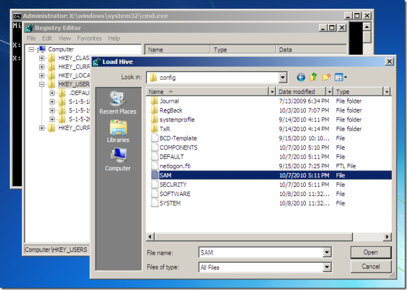
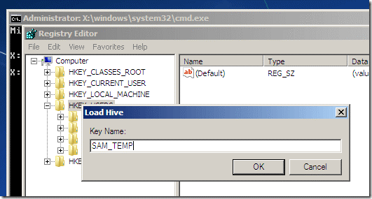
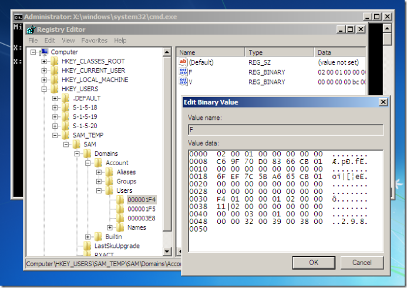
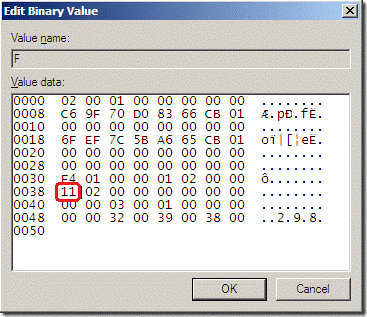

>/.# 如何通过修改注册表的方式解锁被锁定的用户 #

### 问题描述 ###

This is some text. This is some text. This is some text.
This is some text. This is some text. This is some text.
This is some text. This is some text. This is some text.
This is some text. This is some text. This is some text.
This is some text. This is some text. This is some text.
This is some text. This is some text. This is some text.
This is some text. This is some text. This is some text.
This is some text. This is some text. This is some text.
This is some text. This is some text. This is some text.
This is some text. This is some text. This is some text.

在很多情况下, 由于意外操作或者本地安全组策略，将管理员或其他用户锁定， 导致无法正确访问 windows 虚拟机。

### 解决方法 ###

以下方案为通过修改注册表的方式, 解锁上述被锁定的用户：

1. 删除 windows 虚拟机，保留磁盘；
2. 将系统盘挂载到临时虚拟机,假定挂载点为临时虚拟机上的 F 盘；
3. 以管理员身份登陆临时虚拟机；
4. 打开注册表编辑器；

	

6. 选择 HKEY_USERS，然后点击左上角 FILE 菜单，选择 Load Hive；

	

8. 在打开的窗口里，进入目录 F:\Windows\System32\Config，选择 SAM 文件，并点击打开；

	

10. 在键值输入框里输入 SAM_TEMP (或者其他任意名称)，点击 OK；

	

12. 展开 SAM 注册表键值 `SAM_TEMP\SAM\Domains\Account\Users\000001F4`, 双击”F”键值；

	

14. 修改 0038 行的值 11 为 10,然后点击 OK；

	
	

16. 返回选择 SAM_TEMP,点击左上角 FILE 菜单,选择 Unload Hive,点击 Yes 确认；
17. 分离磁盘, 并基于该磁盘新建虚拟机, 再次尝试用相同的用户登陆该虚拟机。
